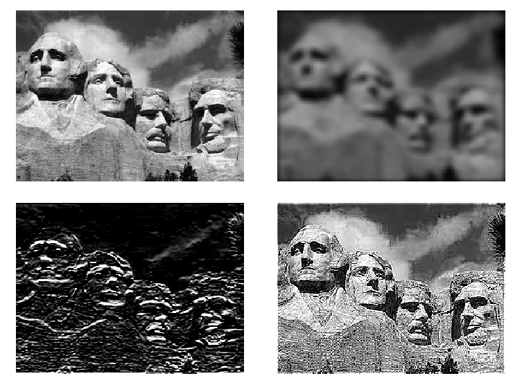

[](http://quantlet.de/)

## [](http://quantlet.de/) **NIC_FFTImageProcessing** [](http://quantlet.de/)

```yaml

Name of QuantLet : NIC_FFTImageProcessing

Published in : Numerical Introductory Course - Student Project on 'Fast Fourier Transform'

Description : 'We perform image processing by applying kernel filters using convolution and the
fast Fourier transform. To do so, we use the 'smoothie' package and its included kernel2dsmooth()
package. We apply these transformations on the image of Mount Rushmore.'

Keywords : FFT, convolution, kernel smoothing, image processing, filter

See also : NIC_FFTMAFilter, NIC_FFTComp, NIC_FFTAlgorithm

Author : Tim Radtke

Submitted : 12.05.2016

Input : mtrush1.pgm

Example : Plot of a random walk together with a 10-point moving average filter

```




### R Code:
```r
# Clear memory
rm(list = ls())

# setwd('~/Tim_Radtke_NIC')

# Load image of Mount Rushmore for image processing later on
mtrush1 = read.pnm("mtrush1.pgm")  # uses 'pixmap' library
# Image source: http://heather.cs.ucdavis.edu/~matloff/ Ignore warning message

# We create copies of the image.
mtrush2 = mtrush1
mtrush3 = mtrush1
mtrush4 = mtrush1

# We apply filters on the greyscale information of the image.  First, we define certain kernels we might use.
# Then, we apply the filter using the kernel2dsmooth() function which implements 2d convolution using the FFT.

point_kernel    = matrix(c(-1, -1, -1, -1, 8, -1, -1, -1, -1), ncol = 3)  # Point filter
sobel_kernel    = t(matrix(c(-1, -2, -1, 0, 0, 0, 1, 2, 1), ncol = 3))  # Sobel
sharpen_kernel  = matrix(c(0, -1, 0, -1, 5, -1, 0, -1, 0), ncol = 3)
mtrush2@grey    = kernel2dsmooth(mtrush1@grey, kernel.type = "gauss", nx = 10, ny = 12, sigma = 4)
mtrush3@grey    = kernel2dsmooth(mtrush1@grey, K = sobel_kernel)
mtrush4@grey    = kernel2dsmooth(mtrush1@grey, K = sharpen_kernel)

# We plot the results in a 2x2 plot They may take a few seconds
par(mfrow = c(2, 2), mar = c(1, 1, 1, 1), mgp = c(1.6, 0.6, 0))
plot(mtrush1)
mtrush2@grey[mtrush2@grey > 1] = 1  # same values are no longer in the [0,1] range
mtrush2@grey[mtrush2@grey < 0] = 0
plot(mtrush2)
mtrush3@grey[mtrush3@grey > 1] = 1
mtrush3@grey[mtrush3@grey < 0] = 0
plot(mtrush3)
mtrush4@grey[mtrush4@grey > 1] = 1
mtrush4@grey[mtrush4@grey < 0] = 0
plot(mtrush4)

# reset plot window format
par(mfrow = c(1, 1), mar = c(5, 4, 4, 2) + 0.1, mgp = c(3, 1, 0))


```
