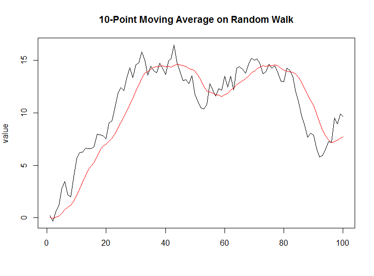

[](http://quantlet.de/index.php?p=info)

## [](http://quantlet.de/) **NIC_FFTMAFilter** [](http://quantlet.de/d3/ia)

```yaml

Name of QuantLet : NIC_FFTMAFilter

Published in : Numerical Introductory Course - Student Project on ''Fast Fourier Transform''

Description : 'Example of a moving average filter through convolution which has been applied on a
random walk using the Fast Fourier Transform.'

Keywords : FFT, convolution, moving average, filter, random walk

See also : NIC_FFTImageProcessing, NIC_FFTAlgorithm, NIC_FFTComp

Author : Tim Radtke

Submitted : 12.05.2016

Example : Plot of a random walk together with a 10-point moving average filter

```




### R Code:
```r
# Clear memory
rm(list = ls())

# install.packages('signal')
library(signal)


# setwd('~/Tim_Radtke_NIC')

par(mfrow = c(1, 1), mar = c(5, 4, 4, 2), mgp = c(3, 1, 0))
set.seed(4)
n = 100
x = cumsum(rnorm(n))
z = fftfilt(rep(1, 10)/10, x)
plot(1:100, x, type = "l", main = "10-Point Moving Average on Random Walk", ylab = "value", xlab = "")
lines(1:100, z, col = "red")

```
