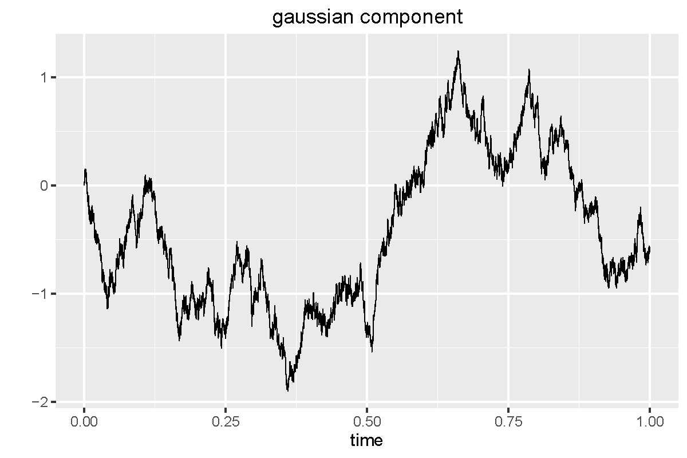
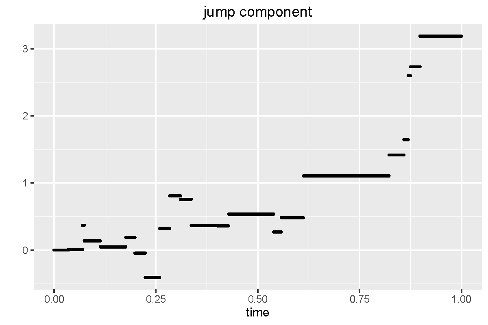
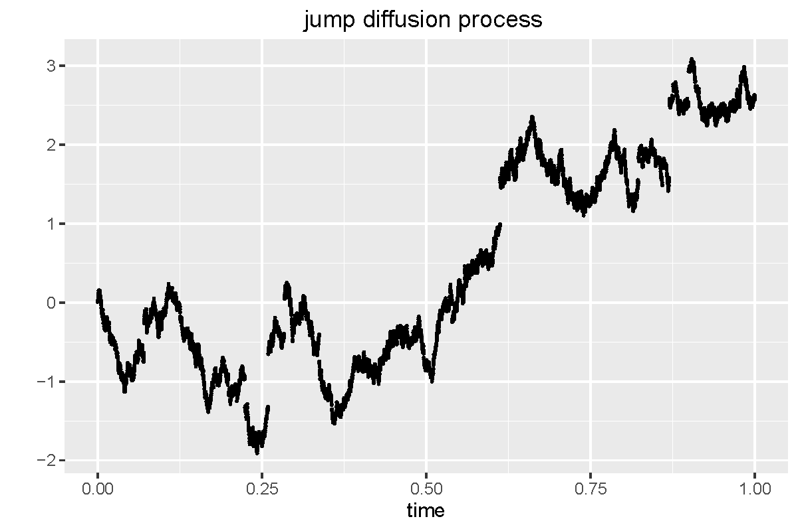
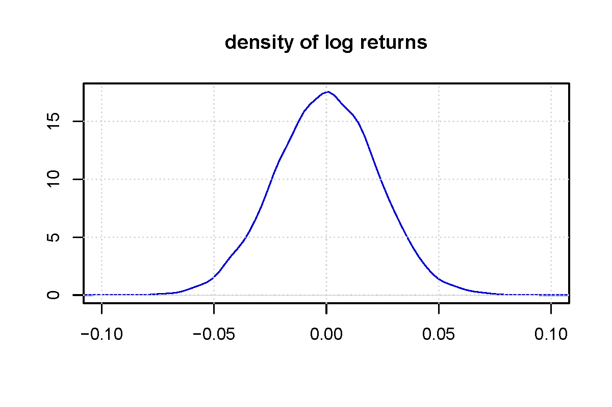
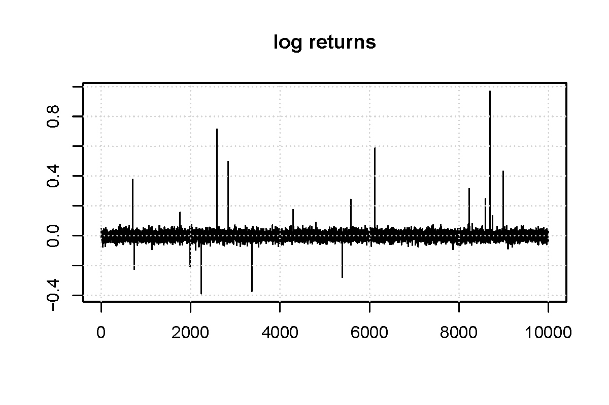

[](http://quantlet.de/)

## [](http://quantlet.de/) **NIC_LevyJumpDiffusion** [](http://quantlet.de/)

```yaml

Name of QuantLet : NIC_LevyJumpDiffusion

Published in : 'Numerical Introductory Course - Student Project on 'Simulation of the Lévy
processes' '

Description : 'Simulates a jump diffusion process with drift b and jump intensity lambda. The
simulated process consists of a Gaussian component and a jump component. Additionally, the
simulated data, the gaussian component, the jump components, log returns and the density of log
returns are plotted. '

Keywords : 'Levy process, stochastic process, jump diffusion, gaussian, jump intensity, drift,
simulation, density'

See also : NIC_LevyPoisson, NIC_LevyStableProcess

Author : Roman Lykhnenko

Submitted : 12.05.2016

Example : Plot of data, gaussian component, jump component, log returns an density of log returns.

```












### R Code:
```r
# Clear memory
rm(list = ls())

#install.packages("ggplot2")
library(ggplot2)

#
# constructor of the class jumpDiffusion----------------------------------------
#

jumpDiffusion = function(drift, jumpIntensity){
  
  # drift parameter
  b = drift
  
  # jump intensity
  lamda = jumpIntensity
  
  # simulation of the process on the the interval [0,T]
  T  = 1
  
  # time step in grid 
  timeStep = 10000
  
  # 
  numbersInTimestep = 4
  
  # fixed time grid
  t = seq(0, T, by = 1/timeStep)
  
  # diffusion volatility
  sigma = 15
  
  # simulate n independent centered gaussian rv G_i 
  G = rnorm(length(t), mean = 0, sd = (1/timeStep)*sigma^2 )
  
  
  
  # compound Poisson #############################################################
  
  # simulate a r.v. N from Poisson distribution with parameter lamda*T.
  # N gives the total number of jumps on the interval [0, T]
  N = rpois(1,lamda*T)
  
  # simulate N independent rv uniformely distributed on the interval [0, T]
  # these variables correspond to the jump times
  U = round(sort(runif(N, min = 0, max = T)), digits=numbersInTimestep)
  
  # initialization of the vector that should contain values of the compound Poisson
  # process at the given set of time points
  X = rep(0, length(t))
  
  # simulate jump sizes: N independent rv Y_i from a specified law
  Y = rnorm(N, mean = 0, sd = 0.5)
  
  # fill vector X, i.e., calculate trajectory of the compound Poisson process
  for (i in (1:length(t)) ) {
    
    # the trajectory is given by
    term1 = sum((U<t[i])*Y)
    X[i]  = term1
    
  }
  
  ################################################################################
  
  # initialization of the vector that should contain values of the jumpDiffusion
  # process at the given set of time points
  jumpDiffusion = rep(0, length(t))
  
  # initialization of the vector that should contain values of the gaussian 
  # component of the process at the given set of time points
  GupToi = rep(0, length(t))
  
  # fill vector jumpDiffusion with values
  for (i in (1:length(t)) ){
    
    # gaussian component 
    count = 0
    for (k in 1:i){
      count = count + G[k]
    }
    GupToi[i] = count
    
    
    jumpDiffusion[i] = b*t[i] + GupToi[i] + X[i]
  }
  
  jumpDiffusionAllData = list(time = t, jump_diffusion = jumpDiffusion,
                               gaussian_component = GupToi,
                               jump_component = X,
                               drift = b,
                               jump_intensity = lamda)
  
  class(jumpDiffusionAllData) = "jumpDiffusion"
  
  return(jumpDiffusionAllData)
  
}


# object of the class jumpDiffusion
instance1 = jumpDiffusion(0,20)


#
# plot method for the class jumpDiffusion ------------------------------------
#
plot.jumpDiffusion = function(instance_jumpDiffusion){
  
  # properties of the process to be plotted
  process = instance_jumpDiffusion$jump_diffusion
  time    = instance_jumpDiffusion$time
  dfPlot  = data.frame(time, process)
  
  # construct name of the file to save the plot (based on the given instance)
  parameter1   = instance_jumpDiffusion$drift
  parameter2   = instance_jumpDiffusion$jump_intensity
  name_of_plot = paste0("process","JumpDiffusion","Drift",  as.character(parameter1),  
                        "JumpIntensity", as.character(parameter2), ".pdf") 
  
  ggplot(dfPlot, aes(time, process)) + geom_point(size=0.3) + 
    xlab("time") +
    ylab("") +
    ggtitle("jump diffusion process ") 
  ggsave(name_of_plot,  width = 6, height =4)
}

plot(instance1)

#
# density of the log returns in exponential Levy model -------------------------
#

# reserve the name of the function, and use UseMethod command to tell R to 
# search for the correct function
returnsDensity = function(someClass) {
  
  UseMethod("returnsDensity", someClass)
  
}

returnsDensity.jumpDiffusion = function(instance_jumpDiffusion){
  
  # log returns of the process
  log_returns = diff(instance_jumpDiffusion$jump_diffusion, lag=1)
  
  # construct name of the file to save the plot (based on the given instance)
  parameter1   = instance_jumpDiffusion$drift
  parameter2   = instance_jumpDiffusion$jump_intensity
  name_of_plot = paste0("retDen","JumpDiffusion","Drift",  as.character(parameter1),  
                        "JumpIntensity", as.character(parameter2), ".pdf") 
  
  # density of the log returns
  pdf(name_of_plot, width = 6, height = 4)
  plot(density(log_returns,kernel="gaussian"), xlim=c(-0.1,0.1),
       col = "blue3", main = "density of log returns", xlab = "",  ylab = "")
  grid()
  dev.off() 
}

# 
returnsDensity(instance1)

#
# plot of the log returns ------------------------------------------------------
#

# reserve the name of the function, and use UseMethod command to tell R to 
# search for the correct function
returnsPlot = function(someClass) {
  
  UseMethod("returnsPlot", someClass)
  
}

returnsPlot.jumpDiffusion = function(instance_jumpDiffusion){
  
  # log returns of the process
  log_returns = diff(instance_jumpDiffusion$jump_diffusion, lag=1)
  
  # construct name of the file to save the plot (based on the given instance)
  parameter1   = instance_jumpDiffusion$drift
  parameter2   = instance_jumpDiffusion$jump_intensity
  name_of_plot = paste0("retPlot","JumpDiffusion","Drift",  as.character(parameter1),  
                        "JumpIntensity", as.character(parameter2), ".pdf")
  
  # plot of log returns
  pdf(name_of_plot, width = 6, height = 4) 
  plot(log_returns, type = "l", xlab = "",  ylab = "", main = "log returns")
  grid()
  dev.off() 
}

returnsPlot(instance1)


#
# plot of gaussian component ---------------------------------------------------
#

# reserve the name of the function, and use UseMethod command to tell R to 
# search for the correct function
gaussianComponentPlot = function(someClass) {
  
  UseMethod("gaussianComponentPlot", someClass)
  
}

gaussianComponentPlot.jumpDiffusion = function(instance_jumpDiffusion){
  
  process = instance_jumpDiffusion$gaussian_component
  time    = instance_jumpDiffusion$time
  dfPlot  = data.frame(time, process)
  
  # construct name of the file to save the plot (based on the given instance)
  parameter1   = instance_jumpDiffusion$drift
  parameter2   = instance_jumpDiffusion$jump_intensity
  name_of_plot = paste0("Gaus","JumpDiffusion","Drift",  as.character(parameter1),  
                        "JumpIntensity", as.character(parameter2), ".pdf")
  
  ggplot(dfPlot, aes(time, process)) + geom_line(size=0.3) + 
    xlab("time") +
    ylab("") +
    ggtitle("gaussian component") 
  ggsave(name_of_plot, width = 6, height = 4)
}

gaussianComponentPlot(instance1)


#
# plot of the jump component ---------------------------------------------------
#

# reserve the name of the function, and use UseMethod command to tell R to 
# search for the correct function
jumpComponentPlot = function(someClass) {
  
  UseMethod("jumpComponentPlot", someClass)
  
}

jumpComponentPlot.jumpDiffusion = function(instance_jumpDiffusion){
  
  process = instance_jumpDiffusion$jump_component
  time    = instance_jumpDiffusion$time
  dfPlot  = data.frame(time, process)
  
  # construct name of the file to save the plot (based on the given instance)
  parameter1   = instance_jumpDiffusion$drift
  parameter2   = instance_jumpDiffusion$jump_intensity
  name_of_plot = paste0("Jump","JumpDiffusion","Drift",  as.character(parameter1),  
                        "JumpIntensity", as.character(parameter2), ".pdf")
  
  ggplot(dfPlot, aes(time, process)) + geom_point(size=0.7) + 
    xlab("time") +
    ylab("") +
    ggtitle("jump component") 
  ggsave(name_of_plot, width = 6, height = 4)
}

jumpComponentPlot(instance1)


```
