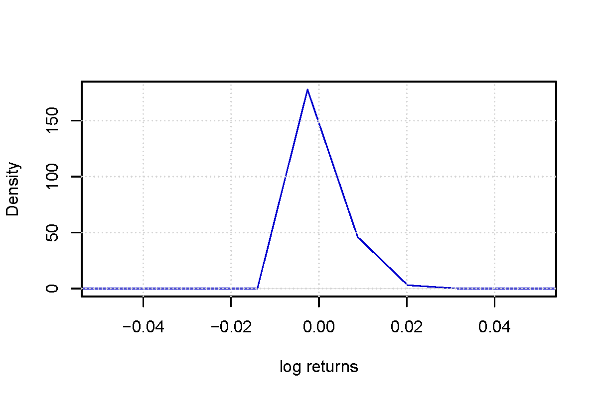
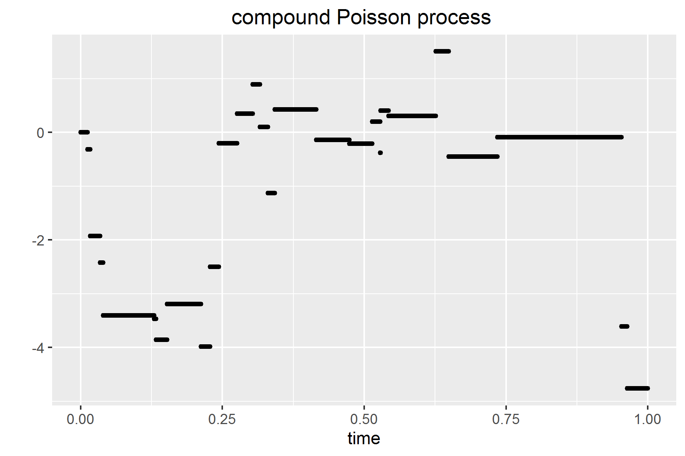
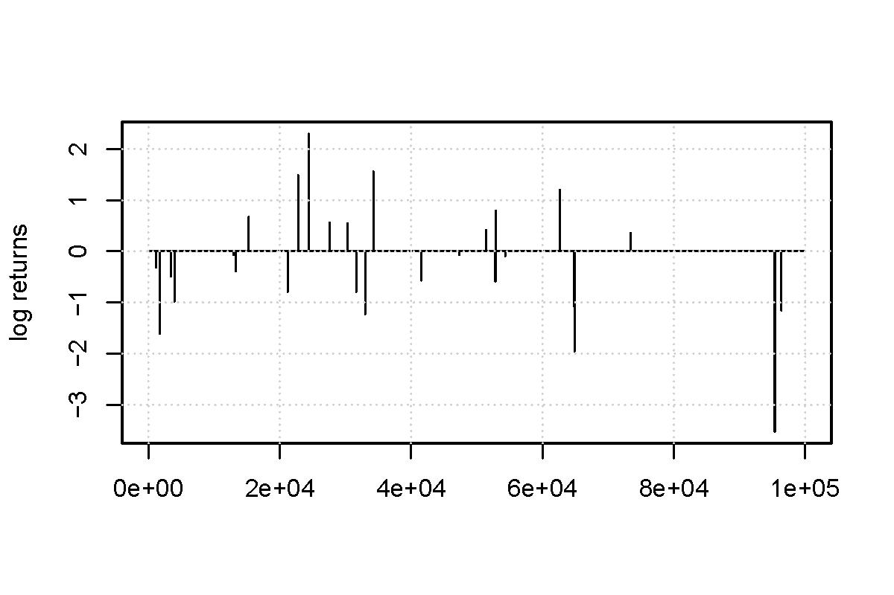

[](http://quantlet.de/)

## [](http://quantlet.de/) **NIC_LevyPoisson** [](http://quantlet.de/)

```yaml

Name of QuantLet : NIC_LevyPoisson

Published in : ' Numerical Introductory Course - Student Project on 'Simulation of the Lévy
processes' '

Description : 'NIC_LevyPoisson simulates a compound poisson process with drift b and jump intensity
lambda. Additionally the simulated data, log returns and density of log returns are plotted.'

Keywords : 'Levy process, stochastic process, simulation, poisson process, jump intensity, return,
density'

See also : NIC_LevyJumpDiffusion, NIC_LevyStableProcess

Author : Roman Lykhnenko

Submitted : 12.05.2016

Example : Plot of data, log returns an density of log returns.

```








### R Code:
```r
# Clear memory
rm(list = ls())

#install.packages("ggplot2")
library(ggplot2)

#
# constructor of the class compoundPoisson -------------------------------------
#
compoundPoisson = function(drift, jumpIntensity){
  
  # drift parameter
  b = drift
  
  # jump parameter
  lamda = jumpIntensity
  
  # simulation of the process on the the interval [0,T]
  T = 1
  
  # at these points value of the process is due to be calculated
  t = seq(0, T, by = 0.00001)
  
  # simulate a r.v. N from Poisson distribution with parameter lamda*T.
  # N gives the total number of jumps on the interval [0, T]
  N = rpois(1,lamda*T)
  
  # simulate N independent rv uniformly distributed on the interval [0, T]
  # these variables correspond to the jump times
  U = sort(runif(N, min = 0, max = T))
  
  # initialization of the vector that should contain values of the stochastic 
  # process at the given set of time points
  X = rep(0, length(t))
  
  # values of the process without adding NAs at the times of jumps
  X_withoutNAs = rep(0, length(t))
  
  # simulate jump sizes: N independent rv Y_i from a specified law
  Y = rnorm(N, mean = 0, sd = 1)
  
  # fill vector X, i.e., calculate trajectory of the process
  for (i in (1:length(t)) ) {
    
    # the trajectory is given by
    term1 = sum((U<t[i])*Y)
    X[i]  = b*t[i] + term1
    
  }
  
  compoundPoissonProcess = list(processValues = X, time = t, drift = b, 
                                jumpIntensity = lamda)
  
  class(compoundPoissonProcess) = "compoundPoisson"
  compoundPoissonProcess
}

# object of the class compoundPoisson
instance1 = compoundPoisson(0,20)

#
# plot method for the class compoundPoisson ------------------------------------
#
plot.compoundPoisson = function(instance_compoundPoisson){
  
  # properties of the process to be plotted
  process = instance_compoundPoisson$processValues
  time    = instance_compoundPoisson$time
  dfPlot  = data.frame(time, process)
  
  # construct name of the file to save the plot (based on the given instance)
  parameter1   = instance_compoundPoisson$drift
  parameter2   = instance_compoundPoisson$jumpIntensity
  name_of_plot =paste0("process","CompoundPoisson","Drift",  as.character(parameter1),  
                        "JumpIntensity", as.character(parameter2), ".pdf") 
  
  ggplot(dfPlot, aes(time, process)) + geom_point(size=1) + 
    xlab("time") +
    ylab("") +
    ggtitle("compound Poisson process ") 
    ggsave(name_of_plot, width = 6, height =4)
}

plot(instance1)

#
# density of the log returns in exponential Levy model -------------------------
#

# reserve the name of the function, and use UseMethod command to tell R to 
# search for the correct function
returnsDensity = function(someClass) {
  
  UseMethod("returnsDensity", someClass)
  
}

returnsDensity.compoundPoisson = function(instance_compoundPoisson){
  
  # log returns of the process
  log_returns = diff(instance_compoundPoisson$processValues, lag=1)
  
  
  # construct name of the file to save the plot (based on the given instance)
  parameter1    = instance_compoundPoisson$drift
  parameter2    = instance_compoundPoisson$jumpIntensity
  name_of_plot  = paste0("retDen","CompoundPoisson","Drift",  as.character(parameter1),  
                        "JumpIntensity", as.character(parameter2), ".pdf") 
  
  # density of the log returns
  pdf(name_of_plot, width = 6, height =4)
  plot(density(log_returns,kernel="gaussian"), xlim=c(-0.05,0.05),
       col = "blue3", main = "", xlab = "log returns",  ylab = "Density")
  grid()
  dev.off() 
}

# 
returnsDensity(instance1)

#
# plot of the log returns ------------------------------------------------------
#

# reserve the name of the function, and use UseMethod command to tell R to 
# search for the correct function
returnsPlot = function(someClass) {
  
  UseMethod("returnsPlot", someClass)
  
}

returnsPlot.compoundPoisson = function(instance_compoundPoisson){
  
  # log returns of the process
  log_returns = diff(instance_compoundPoisson$processValues, lag=1)
  
  # construct name of the file to save the plot (based on the given instance)
  parameter1 = instance_compoundPoisson$drift
  parameter2 = instance_compoundPoisson$jumpIntensity
  name_of_plot =paste0("retPlot","CompoundPoisson","Drift",  as.character(parameter1),  
                        "JumpIntensity", as.character(parameter2), ".pdf") 
  
  # density of the log returns
  # plot of log returns
  pdf(name_of_plot, width = 6, height =4) # plot_name: variable from global environment
  plot(log_returns, type = "l", xlab = "",  ylab = "log returns", main = "")
  grid()
  dev.off() 
}

returnsPlot(instance1)


```
