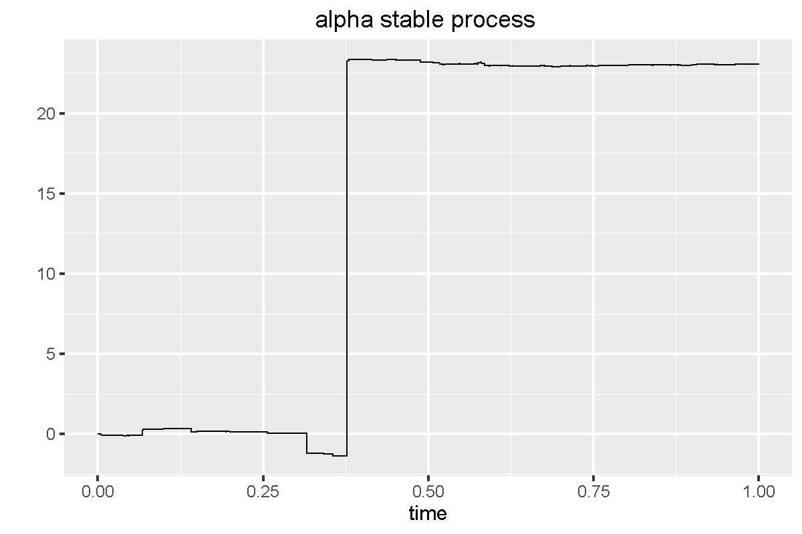
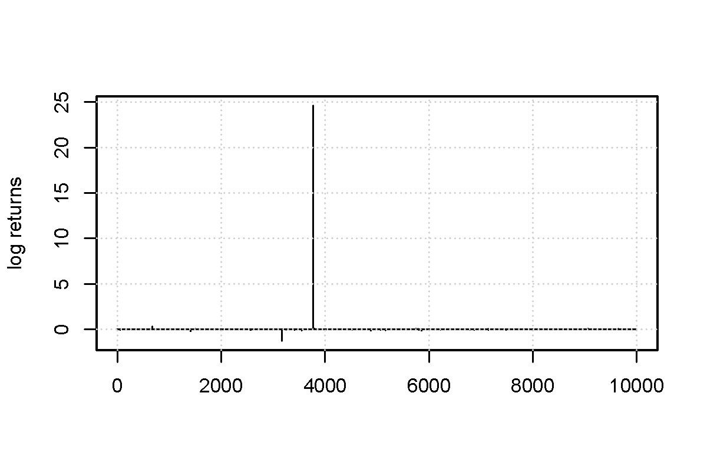
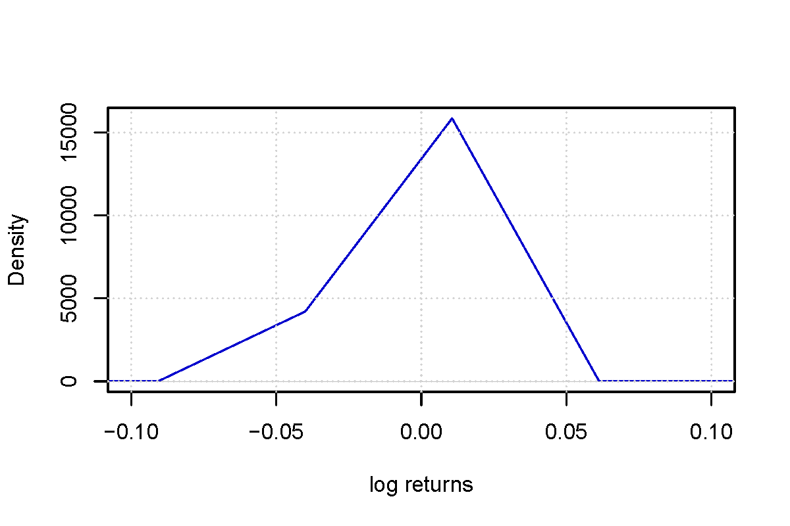

[](http://quantlet.de/index.php?p=info)

## [](http://quantlet.de/) **NIC_LevyStableProcess** [](http://quantlet.de/d3/ia)

```yaml

Name of QuantLet : NIC_LevyStableProcess

Published in : 'Numerical Introductory Course - Student Project on ''Simulation of the Lévy
processes'' '

Description : 'Simulates an alpha stable Lévy process and plots the simulated data, log returns
and the density of log returns. '

Keywords : Levy process, stochastic process, simulation, stable, return, density, jump, fat tails

See also : NIC_LevyJumpDiffusion, NIC_LevyPoisson

Author : Roman Lykhnenko

Submitted : 12.05.2016

Example : Plot of data, log returns an density of log returns.

```








### R Code:
```r
# Clear memory
rm(list = ls())

#install.packages("ggplot2")
library(ggplot2)

#
# constructor of the class alphaStable  ----------------------------------------
#

alphaStable = function(alpha){
  
  # time step in grid 
  timeStep = 10000
  
  # fixed time grid
  t = seq(0, T, by = 1/timeStep)
  
  # number of time points
  n = length(t)
  
  # n independent uniformely distributed rv
  gamma = runif(n, min = -pi/2, max = pi/2)
  
  # n independent standart exponential rv
  W = rexp(n, rate = 1)
  
  deltaX = (1/timeStep)^(1/alpha)*sin(alpha)*gamma/((cos(gamma))^(1/alpha))*
    (cos((1-alpha)*gamma)/W)^((1-alpha)/alpha) 
  
  # initialization of the vector that should contain values of  
  # process at the given set of time points
  X = rep(0, length(t))
  
  for (i in 1:length(t)){
    
    sumDeltaX = 0
    
    for (j in 1:i){
      sumDeltaX = sumDeltaX + deltaX[j]
    }
    
    X[i] = sumDeltaX
  } 
  
  alpha_stable_data = list(time=t, process=X, alpha=alpha)
  
  class(alpha_stable_data) = "alphaStable"
  
  return(alpha_stable_data)
  
}

# object of the class alphaStable
instance1 = alphaStable(1)


#
# plot method for the class alphaStable ----------------------------------------
#
plot.alphaStable = function(instance_alphaStable){
  
  # properties of the process to be plotted
  process = instance_alphaStable$process
  time = instance_alphaStable$time
  dfPlot = data.frame(time, process)
  
  # construct name of the file to save the plot (based on the given instance)
  parameter = instance_alphaStable$alpha
  name_of_plot =paste0("process", "Stable", as.character(parameter), ".pdf")
  
  # plotting procedure
  ggplot(dfPlot, aes(time, process)) + geom_line(size=0.3) + 
    xlab("time") + 
    ylab("") + 
    ggtitle("alpha stable process ") +
    ggsave(name_of_plot, width = 6, height =4)
}

plot(instance1)

#
# density of the log returns in exponential Levy model -------------------------
#

# reserve the name of the function, and use UseMethod command to tell R to 
# search for the correct function
returnsDensity = function(someClass) {
  
  UseMethod("returnsDensity", someClass)
  
}

returnsDensity.alphaStable = function(instance_alphaStable){
  
  # log returns of the process
  log_returns = diff(instance_alphaStable$process, lag=1)
  
  # construct name of the file to save the plot (based on the given instance)
  parameter = instance_alphaStable$alpha
  name_of_plot =paste0("retDen","Stable", as.character(parameter), ".pdf")
  
  # density of the log returns
  pdf(name_of_plot, width = 6, height = 4)
  plot(density(log_returns,kernel="gaussian"), xlim=c(-0.1,0.1),
       col = "blue3", main = "", xlab = "log returns",  ylab = "Density")
  grid()
  dev.off() 
}

# 
returnsDensity(instance1)

#
# plot of the log returns ------------------------------------------------------
#

# reserve the name of the function, and use UseMethod command to tell R to 
# search for the correct function
returnsPlot = function(someClass) {
  
  UseMethod("returnsPlot", someClass)
  
}

returnsPlot.alphaStable = function(instance_alphaStable){
  
  # log returns of the process
  log_returns = diff(instance_alphaStable$process, lag=1)
  
  # construct name of the file to save the plot (based on the given instance)
  parameter = instance_alphaStable$alpha
  name_of_plot =paste0("retPlot","Stable", as.character(parameter), ".pdf")
  
  # plot of log returns
  pdf(name_of_plot, width = 6, height =4) 
  plot(log_returns, type = "l", xlab = "",  ylab = "log returns", 
       main = "")
  grid()
  dev.off() 
}

returnsPlot(instance1)
```
